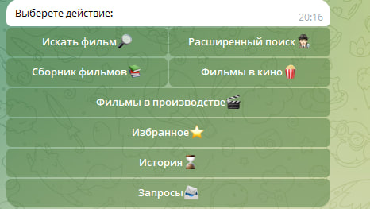
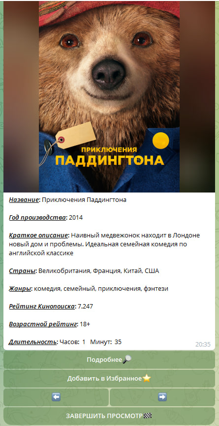
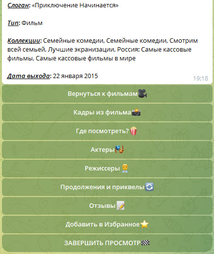
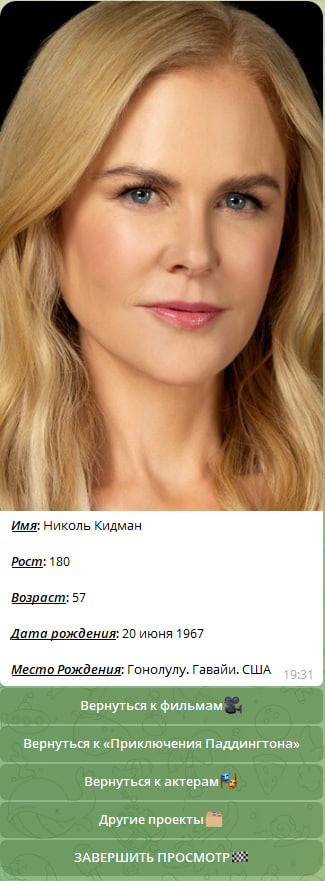
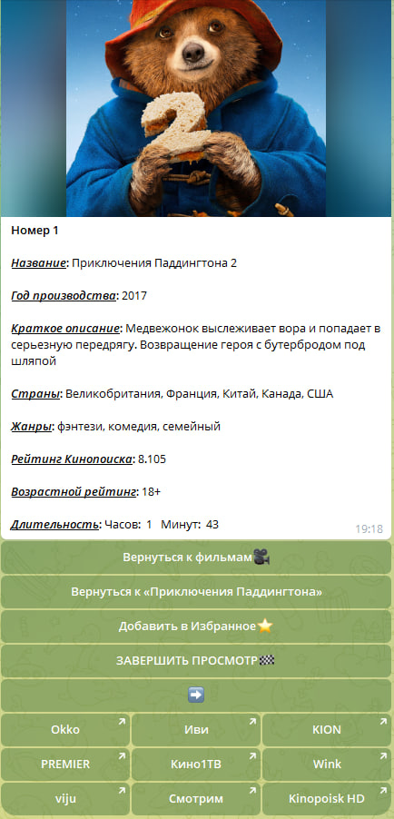

# Простой Телеграм-бот для поиска фильмов
___
## Стартовое меню

___

___
## Просмотр фильмов

___

___
## Детальная информация c возможностью просмотра отзывов и доступных онлайн-кинотеатров

___

___
## Актеры и режиссеры с возможностью просмотра информации о них и их других проектах

___

___
## Продолжения фильмов по порядку относительно просматриваемого

___


# Основные используемые фреймворки и инструменты

* ### [Aiohttp](https://docs.aiohttp.org/en/stable/)
* ### [Aiogram](https://aiogram.dev/)
* ### [Alembic](https://alembic.sqlalchemy.org/en/latest/)
* ### [SQLAlchemy](https://www.sqlalchemy.org/)

## Что позволяет делать бот?
* Находить фильм по названию
* Искать фильмы, сериалы, мультики на свой вкус по самым разным критериям. От компании производителя до года релиза
* Смотреть фильмы из уже собранных больших коллекций
* Удобно просматривать проекты, которые сейчас идут в кино
* Быть в курсе всех событий в мире кино индустрии благодаря предоставлению данные о проектах, ожидающих выхода
* Просматривать и удалять историю просмотров
* Добавлять самые интересные фильмы в "Избранное", чтобы не забыть о них
* Быстро возвращаться к месту, на котором остановился смотреть фильмы. Таким образом можно продолжать смотреть коллекцию из 500+ проектов в любой момент времени без нужды делать запрос заново
* Оперативно смотреть информацию об актерах, режиссерах и их иных проектов
* Сразу узнавать площадки для легального просмотра и отзывы без нужды выходить из телеграма
* Смотреть другие части или похожие фильмы
* Получать кадры из фильма для фанатов ставить их на аватарки или других целей :)

## Как настроить корректную работу бота?
* Убедиться, что docker установлен на локальной машине ([Как установить Docker?](https://docs.docker.com/get-started/get-docker/))
* Склонировать репозиторий на локальную машину
```sh
git https://github.com/raydqver/movie-search-engine.git
```

* Создать файл .env, подобный .env.template в корне проекта только с нужными данными:

1. [x] Токен бота от [BotFather](https://t.me/BotFather)
2. [x] API-ключ с сайта [Кинопоиск API](https://kinopoisk.dev/)
* Запустить докер контейнер
```sh
docker compose up -d
```

## Какие параметры хранятся в файле .env.template?

#### API_KEY - Ключ для работы с сервисом, предоставляющем информацию
#### BOT_TOKEN - Токен для взаимодействия с базой данных

#### HOST - Хост базы данных
#### PORT - Порт базы данных
#### POSTGRES_USER - Логин пользователя 
#### POSTGRES_PASSWORD - Пароль пользователя
#### POSTGRES_DB - Название базы данных

#### NUMBER_FILMS - Количество подгружаемых за раз фильмов
#### NUMBER_REVIEWS - Количество подгружаемых отзывов
#### NUMBER_PHOTOS - Количество подгружаемых фотографий из фильма
#### NUMBER_PERSONS - Количество подгружаемых людей
#### NUMBER_PROJECTS - Количество подгружаемых похожих проектов
#### DAYS_BEFORE_DELETION - Количество дней, сколько будут храниться сохраненные запросы (чем больше данный параметр, тем вероятнее, что данные будут неактуальны)
